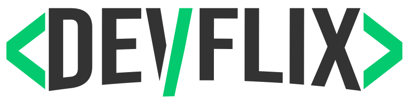
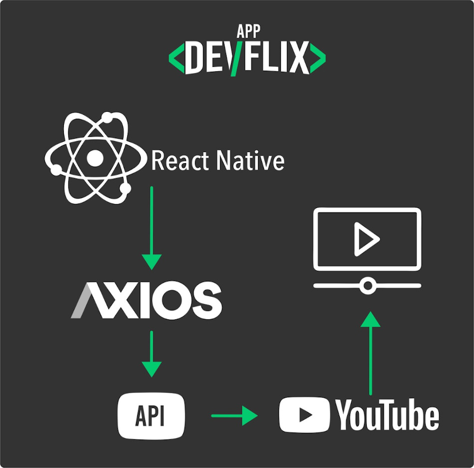

<p align="center">
   
</p>

# :movie_camera: DevFlix

> Aplicação para você dev, poder assistir vídeos sobre programação.

[![NPM Version][npm-version]][npm-version]
[![NPM License][npm-license]][npm-license]
[![GitHub Stars][github-stars]][github-stars]
[![Code Size][code-size]][code-size]

Aplicativo mobile que consome a Api do Youtube e lista conteúdos para desenvolvedores de software e apaixonados por programação.

<!-- <p align="center">
  
</p>
 -->

## :nazar_amulet: Objetivo

| O objetivo desta app é tornar mais rápido o acesso a contéudos de programação tais como vídeos e playlists de cursos. Os contéudos já estão pré-selecionados para que você não perca tempo procurando.

## :black_nib: Justificativa

| Esse aplicativo faz parte das atividades da disciplina Desenvolvimento Mobile do curso de Desenvolvimento de Sistemas do Senai Dendezeiros, Salvador/BA.

## :man_technologist: Autor

| Foto                                                                                                                             | Nome                      | GitHub                                   | Likedin                                                 | E-mail                    |
| -------------------------------------------------------------------------------------------------------------------------------- | ------------------------- | ---------------------------------------- | ------------------------------------------------------- | ------------------------- |
|  | Jefferson de Santana Eloy | [Jefferson](https://github.com/jeffeloy) | [Linkedin](https://www.linkedin.com/in/jefferson-eloy/) | contatojeloydev@gmail.com |

## :computer: Tecnologias

- [React Native](https://facebook.github.io/react-native/)
- [Expo](https://docs.expo.io)
- [Axios](https://github.com/axios/axios)
- [Styled Components](https://styled-components.com)

## :construction_worker: Instalação

Você precisa instalar o [Node.js](https://nodejs.org/en/download/) e o [Expo](https://docs.expo.io) primeiro e, em seguida clone o repositório executando este comando:

```
git clone https://github.com/jeffeloy/devflix.git
```

## :wrench: Instalar dependências

### :iphone: Mobile

1. Execute `npm install` para instalar as dependências;
2. Execute `npm start` para iniciar o aplicativo;

## :gear: Arquitetura do App

Uma amostra de como as tecnologias estão se relacionando no DevFlix.



Foi utilizado o React Native para desenvolver a estrutura do app, e através da biblioteca axios consumimos a api do Youtube que nos retorna os vídeos desejados.

## :handshake: Contribuindo

Confira a página [CONTRIBUTING](https://github.com/jeffeloy/devflix/blob/master/CONTRIBUTING.md) página para ver os melhores locais para arquivar problemas, iniciar discussões e começar a contribuir.

## :open_book: License

Lançado em 2020.
Este projeto está sob a [MIT license](https://github.com/jeffeloy/devflix/blob/master/LICENSE).

<p align="center">
    Feito com :heart: por <a href="https://github.com/jeffeloy">Jefferson Eloy</a>
</p>

<!-- Markdown link & img dfn's -->

[github-stars]: https://img.shields.io/github/stars/jeffeloy/ecoleta?logoColor=03ca6f&style=social
[npm-license]: https://img.shields.io/npm/l/express?color=03ca6f&style=plastic
[npm-version]: https://img.shields.io/npm/v/npm?color=333333&style=plastic
[code-size]: https://img.shields.io/github/languages/code-size/jeffeloy/devflix?color=03ca6f&style=plastic
